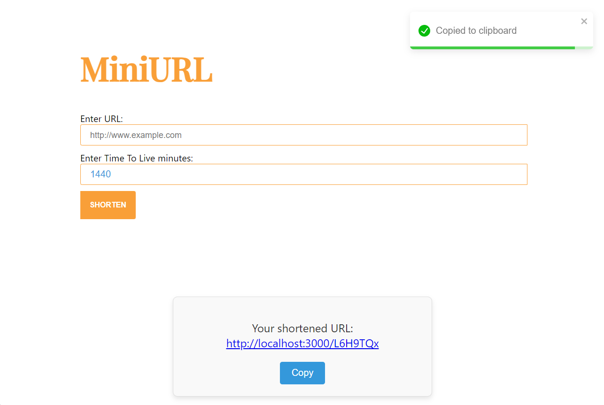

# MiniURL

A URL shortener web application using React.js, Spring and MongoDB.





## Tech Stack

### React 18: 
Chosen for its efficient rendering with hooks and concurrent features, ideal for creating a fast, dynamic user interface.

### Spring 3.3.4: 
Selected for its flexibility and enterprise-grade support for building RESTful web services. Looking to expand knowledge in backend Java development.

### NGINX 1.25.1: 
Used as a reverse proxy and load balancer to ensure scalability and handle traffic efficiently in the future, enhancing performance for the web application.

### MongoDB: 
Preferred in this case for its NoSQL, document-based model, prioritizing speed and scalability over complex relational data, making it ideal for handling high-speed data access without joins. The Time-to-live Index is also a plus.


## Features

- Shorten URL
- Set time limit for the shortened URL
- Redirect to the original


## Roadmap
- UI improvement
- Password feature
- Custom url feature
- Deployment


## Installation

### Required Tools
- [Node v18+](https://nodejs.org/en/download/package-manager) 
- JDK 21 (E.g: [Eclipse Temurin](https://adoptium.net)...)
- [MongoDB Community Server](https://www.mongodb.com/try/download/community) 
- [Maven 3.9.9](https://maven.apache.org/download.cgi)

### On Docker
It's highly recommended to use Docker to prevent the hassle of setting up enviroment.

First off, let's clone this repo:
```bash
  gh repo clone VDT1805/MiniURL
```
Get to root folder:
```bash
  cd MiniURL
```
We can easily run the whole system with only a single command:

```bash
  docker compose up
```
Docker will pull the MongoDB and Spring Boot images (if our machine does not have it before). 

We can easily access the web on port 3000
```bash
  localhost:3000
```

### On Local
You will need the required tools installed in your computer.

First off, let's clone this repo:
```bash
  gh repo clone VDT1805/MiniURL
```

Get to root folder:
```bash
  cd MiniURL
```
#### Frontend:
Open the folder and install dependencies:
```bash
  cd miniurl-frontend
  npm install
```

Runs the app in the development mode.

This will run on port 5173.

Open http://localhost:5173 to view it in the browser:

```bash
  npm run dev
```
#### Backend:
Open the folder and install dependencies:
```bash
  cd miniurl-backend
```

Runs the backend via Maven.

```bash
  mvn spring-boot:run
```
The backend will run on port 8080

## API Overview

### Shorten URL

- API
```http
POST /api/shorten
```

| Parameter | Type | Description |
| :--- | :--- | :--- |
| `originalUrl` | `string` | **Required**. The original URL to be shortened |
| `expireAfter` | `number` | **Required**. TTL minutes |

- Responses

This will give back a pair of value, the unique shortened code for shortened URL and the original URL
``` javscript
{
  "shortenedCode": string,
  "originalUrl": string
}
```


### Get back the original URL

- API
```http
GET /api/{shortenedCode}
```

| Parameter | Type | Description |
| :--- | :--- | :--- |
| `shortenedCode` | `string` | **Required**. The shortened code |

- Responses

This will also give back a pair of value, the unique shortened code for shortened URL and the original URL
``` javscript
{
  "shortenedCode": string,
  "originalUrl": string
}
```

### Status Codes

Miniurl returns the following status codes in its API:

| Status Code | Description |
| :--- | :--- |
| 200 | `OK` |
| 404 | `NOT FOUND` |
| 500 | `INTERNAL SERVER ERROR` |

## DB Design
The database is very simple. So there will not be any schema.

### Database Schema

The application uses MongoDB with the following schema for managing URLs:

```java
public class UrlModel {
    @Id
    private String id; // shortCodeURL
    private String originalUrl;
    private LocalDateTime createdAt;
    @Indexed(expireAfterSeconds = 0)
    private LocalDateTime expiredAt;
}
```
- id: A unique identifier (shortCodeURL) for the shortened URL.
- originalUrl: The original, full-length URL.
- createdAt: The timestamp when the URL was created.
- expiredAt: The expiration time for the shortened URL, automatically removed by MongoDB after expiration (expireAfterSeconds index).

## Environment Variables

### On Docker

The ```.env``` on root folder is dedicated for ```docker-compose.yml```

- **MONGODB_USER**: Username for MongoDB authentication.
- **MONGODB_PASSWORD**: Password for MongoDB.
- **MONGODB_DATABASE**: The name of the MongoDB database used.
- **MONGODB_LOCAL_PORT**: The local port for MongoDB.
- **MONGODB_DOCKER_PORT**: The port for MongoDB in the Docker container.

- **SPRING_LOCAL_PORT**: The local port on which the Spring application runs.
- **SPRING_DOCKER_PORT**: The port for Spring in the Docker container.
- **SPRING_PROFILES_ACTIVE**: Specifies the active profile for the Spring application, set to `docker` for Docker-specific configurations.

- **REACT_LOCAL_PORT**: The local port for the React frontend.
- **REACT_DOCKER_PORT**: The port for React in the Docker container.

The backend environment file for docker env is in:
```
    miniurl-backend\src\resources\application-docker.properties
```
### On Local
You can create a new environment file and run it by changing the `spring.profiles.active` value in the `application.properties` file. This allows you to switch between different profiles for different environments (e.g., `dev`, `prod`, `docker`).

For example, to activate the ```dev``` environment, set:
```spring.profiles.active=dev```
This will apply the configurations specified in the `application-dev.properties` file.